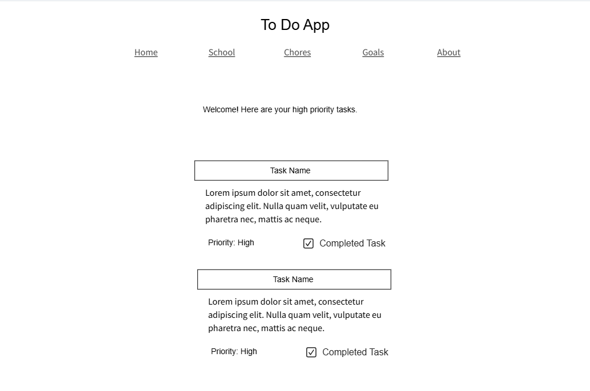
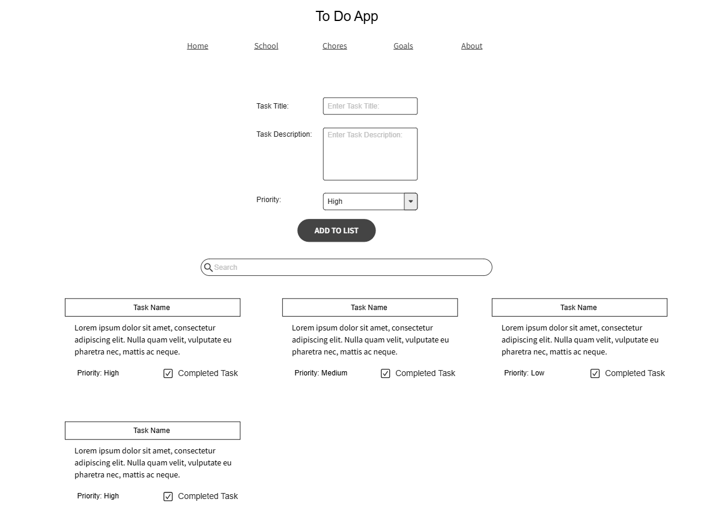

# Web Dev Starter Code

## Project Spec

### General Theme
For my project, I want to create a simple TODO app. The app will have different categories for the to do items, such as school, chores, personal goals, etc. The app will be general so that anyone can use it. 

### What is it going to do?
The goal of the website is to allow the user to create and organize their to-do items into different categories. 

There will be a homepage that will welcome the user and show the high priority tasks. There will also be an about page that will explain how to use the website. Along with these, there will also be different web pages that will separate the different categories of tasks, so “school” tasks will have their own web page, “chores” will have its own page, and so on. The user will be able to select one of these pages and add their task to that page. The app is going to take a user's input and display it as an item on a list. The user will be able to provide the title and description of a to-do item. These two inputs will be required from the user. Along with this, the user will give a priority to the item and the items will be organized in different columns according to the specified priority. If a priority is not provided, the default value will be a low priority. Once the to-do item is added, there will be options to remove or check off the item.  As a way to conditionally retrieve data, I think it would be good to add a search feature for the to-do items, so only items that contain a certain word will be displayed and all other items will be omitted. 

### Who is the target audience?
The target audience will be students since there will be a built-in “school” category, but anyone could use it to create and organize a to-do list.  

### What sort of data will it manage?
The user will provide the title, description, and priority of a task. These will be used to display and organize the tasks onto the webpage. 

### Stretch Goals
It might be fun to give the user different options between the look of the website, such as having a dark mode or light mode. As for additional functions, it could be nice to give the user the option to add images to the list items. It could also be good to have the tasks have a due date or to somehow add a calendar to the app. Also, I would like to add the option to edit a task. I’m not sure how difficult it would be to add this feature, so it will not be a top priority, but it would definitely be a good feature to have. In a similar way, it would be good for a user to add their own category so that they are not limited to the ones that are built in. This way, the user is able to further customize their experience.

## Project Wireframe

